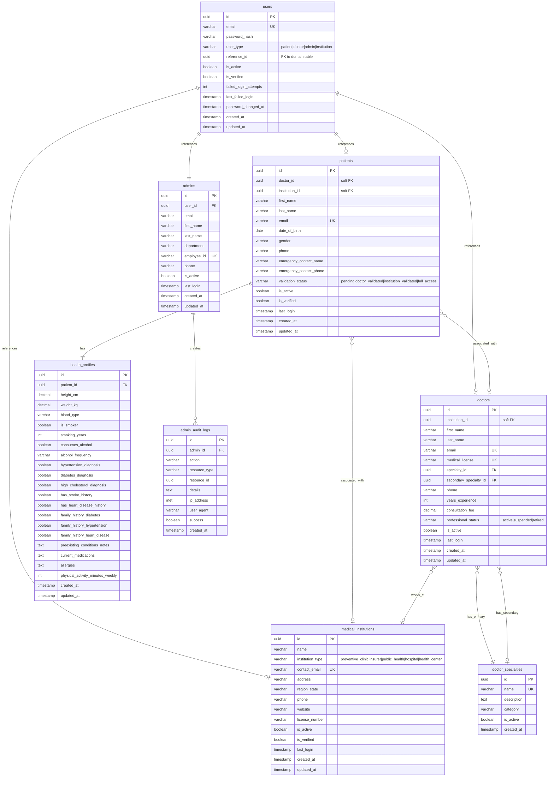
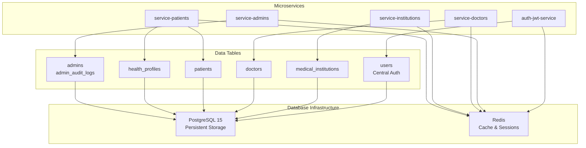

# PredictHealth Database

This directory contains the database infrastructure and configuration for the PredictHealth healthcare platform. It manages both PostgreSQL for persistent data storage and Redis for caching and session management.

## Overview

The PredictHealth database system is designed to support a microservices architecture for a healthcare platform. It provides centralized data storage for user authentication, medical institutions, doctors, patients, health profiles, and administrative functions.

## Components

### PostgreSQL Database

- **Version**: PostgreSQL 15
- **Purpose**: Primary relational database for all persistent data
- **Schema**: Comprehensive schema supporting multiple user types and healthcare domain entities
- **Initialization**: Automated schema creation via `init.sql` on container startup

### Redis Cache

- **Purpose**: In-memory data store for caching, sessions, and temporary data
- **Configuration**: Custom configuration with persistence and memory management
- **Memory Limit**: 1GB with LRU eviction policy

## Database Schema

The PostgreSQL database consists of the following main tables:

### Core Tables

- **users**: Centralized authentication table for all user types (patients, doctors, admins, institutions)
- **medical_institutions**: Healthcare institutions (clinics, hospitals, insurers, etc.)
- **doctor_specialties**: Medical specialty definitions
- **doctors**: Healthcare provider profiles
- **patients**: Patient information and associations
- **health_profiles**: Detailed health information for patients

### Administrative Tables

- **admins**: Administrative user profiles
- **admin_audit_logs**: Audit trail for administrative actions

### Key Relationships

```
users (1) ──── (1) domain entities (doctors/patients/admins)
    │
    └── user_type determines reference_id target
```

- Patients must be associated with either a doctor or institution
- Doctors can belong to institutions (soft reference)
- Health profiles are 1:1 with patients
- Admin audit logs track all administrative actions

## Database Schema ER Diagram



## Configuration

### Environment Variables (.env)

- `DATABASE_URL`: PostgreSQL connection string
- `REDIS_URL`: Redis connection string
- `MIGRATION_LOG_LEVEL`: Logging level for migration scripts
- `BACKUP_RETENTION_DAYS`: Database backup retention policy
- `ADMIN_EMAIL`/`ADMIN_PASSWORD`: Default admin credentials

### Dependencies (requirements.txt)

- `psycopg2-binary>=2.9.0`: PostgreSQL adapter for Python
- `python-dotenv>=0.19.0`: Environment variable management

## How the Database Operates

### Initialization

1. PostgreSQL container starts with custom Dockerfile
2. `init.sql` executes on first run, creating:
   - Database extensions (uuid-ossp, pgcrypto)
   - All tables with constraints and indexes
   - Timestamp triggers for automatic `updated_at` management
   - Initial data (doctor specialties, default admin user)

### Data Flow

1. **Authentication**: All users authenticate via the centralized `users` table
2. **Domain Services**: Microservices (doctors, patients, institutions, admins) manage their respective domain data
3. **Caching**: Redis handles session data, temporary caches, and high-frequency reads
4. **Auditing**: Administrative actions are logged in `admin_audit_logs`

### Microservices Integration

The database serves the following microservices:

- **auth-jwt-service**: User authentication and JWT token management
- **service-admins**: Administrative user management and audit logging
- **service-doctors**: Doctor profiles and specialty management
- **service-institutions**: Medical institution management
- **service-patients**: Patient data and health profile management

Each microservice connects to PostgreSQL for persistent data operations and Redis for session/caching needs.

## Architecture Diagram



## Maintenance and Operations

### Backups

- Configured for 30-day retention
- Automated backup scripts can use the provided environment variables

### Monitoring

- Admin audit logs provide comprehensive tracking of administrative actions
- Failed login attempts and user activity are tracked in the users table

### Performance

- Indexes created on frequently queried columns
- Redis LRU policy manages memory efficiently
- Timestamp triggers ensure data consistency

## Development Setup

1. Ensure Docker and Docker Compose are installed
2. The database containers are orchestrated via the project's `docker-compose.yml`
3. Environment variables in `.env` are loaded automatically
4. Python scripts in this directory can be used for migrations and maintenance

## Security Considerations

- Passwords are stored as bcrypt hashes
- Admin credentials are predefined but should be changed in production
- Redis is configured without protected mode for container networking
- Audit logs track all administrative actions with IP and user agent information