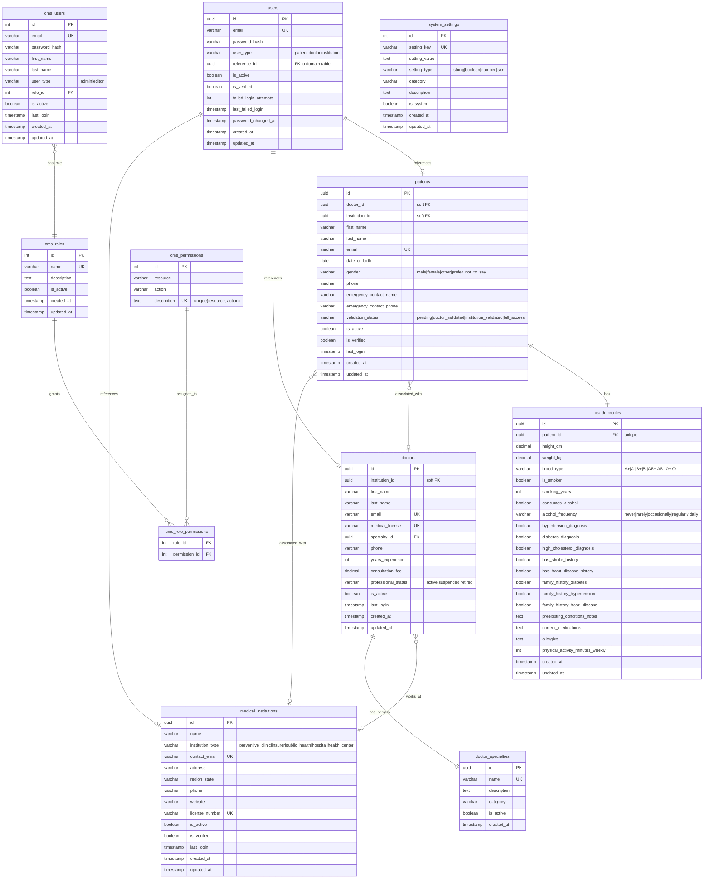

# Base de Datos PredictHealth

Este directorio contiene la infraestructura y configuración de base de datos para la plataforma de salud PredictHealth. Gestiona tanto PostgreSQL para almacenamiento persistente de datos como Redis para caché y gestión de sesiones.

## Resumen

El sistema de base de datos PredictHealth está diseñado para soportar una arquitectura de microservicios para una plataforma de salud. Proporciona almacenamiento centralizado de datos para autenticación de usuarios, instituciones médicas, doctores, pacientes, perfiles de salud y funciones administrativas.

## Componentes

### Base de Datos PostgreSQL

- **Versión**: PostgreSQL 15
- **Propósito**: Base de datos relacional primaria para todos los datos persistentes
- **Esquema**: Esquema completo que soporta múltiples tipos de usuario y entidades de dominio de salud
- **Inicialización**: Creación automática de esquema vía `init.sql` al inicio del contenedor

### Caché Redis

- **Propósito**: Almacén de datos en memoria para caché, sesiones y datos temporales
- **Configuración**: Configuración personalizada con persistencia y gestión de memoria
- **Límite de Memoria**: 1GB con política de eviction LRU

## Esquema de Base de Datos

La base de datos PostgreSQL está optimizada para Tercera Forma Normal (3NF) y consiste en las siguientes tablas principales:

### Tablas Core de Salud

- **users**: Tabla centralizada de autenticación para todos los tipos de usuario (pacientes, doctores, instituciones)
- **medical_institutions**: Instituciones de salud (clínicas, hospitales, aseguradoras, etc.)
- **doctor_specialties**: Definiciones de especialidades médicas con categorías
- **doctors**: Perfiles de proveedores de salud con especialidades e instituciones
- **patients**: Información de pacientes con flujo de trabajo de validación
- **health_profiles**: Información completa de salud (1:1 con pacientes)

### Tablas CMS (Sistema de Gestión de Contenido)

- **cms_users**: Cuentas de usuario CMS (roles admin/editor)
- **cms_roles**: Definiciones de roles (Admin, Editor)
- **cms_permissions**: Permisos granulares (pares recurso-acción)
- **cms_role_permissions**: Tabla de unión para asignaciones rol-permiso
- **system_settings**: Configuración dinámica del sistema

### Relaciones Clave

```
users (1) ──── (1) entidades de dominio (pacientes/doctores/instituciones)
    │
    └── user_type determina el objetivo de reference_id
```

- Los pacientes deben estar asociados con un doctor O institución (restricción aplicada)
- Los doctores pueden pertenecer opcionalmente a instituciones (referencia suave)
- Los perfiles de salud son 1:1 con pacientes (restricción única)
- Los usuarios CMS tienen permisos basados en roles a través de tablas de unión normalizadas
- La configuración del sistema proporciona gestión de configuración en tiempo de ejecución

## Diagrama ER del Esquema de Base de Datos



## Características Avanzadas de Base de Datos

### Procedimientos Almacenados

La base de datos incluye procedimientos almacenados optimizados para operaciones complejas:

- **`sp_create_patient_with_profile`**: Registro atómico de paciente con creación de perfil de salud
- **`sp_get_patient_stats_by_month`**: Reportes KPI para métricas y análisis de pacientes
- **`sp_get_doctor_performance_stats`**: Métricas de rendimiento de doctores y atención al paciente
- **`sp_get_institution_analytics`**: Análisis y estadísticas a nivel institucional

### Vistas de Base de Datos

Vistas pre-optimizadas para dashboards y reportes:

- **`vw_patient_demographics`**: Datos demográficos de pacientes con asociaciones doctor/institución
- **`vw_doctor_performance`**: Métricas de rendimiento de doctores y conteos de pacientes
- **`vw_monthly_registrations`**: Análisis de registros por mes
- **`vw_health_condition_stats`**: Estadísticas de salud poblacional y prevalencia
- **`vw_dashboard_overview`**: Métricas generales de resumen del sistema
- **`vw_doctor_specialty_distribution`**: Análisis de distribución de especialidades
- **`vw_geographic_distribution`**: Distribución geográfica de entidades de salud
- **`vw_health_condition_prevalence`**: Estadísticas de prevalencia de condiciones de salud
- **`vw_patient_validation_status`**: Estado de flujo de trabajo de validación de pacientes

### Optimización de Rendimiento

#### Índices Estratégicos
- Índices parciales en registros activos para tablas consultadas frecuentemente
- Índices compuestos para operaciones complejas de join
- Índices de clave foránea para rendimiento de integridad referencial
- Índices especializados para filtrado de condiciones de salud

#### Gestión de Memoria
- Política LRU de Redis con límite de 1GB de memoria
- Persistencia automática de snapshots
- Planes de consulta optimizados mediante indexación estratégica

### Restricciones de Integridad de Datos

#### Restricciones de Lógica de Negocio
- Validación de asociación de pacientes (debe tener doctor O institución)
- Validación de consistencia de contacto de emergencia
- Validación de lógica de consumo de tabaco/alcohol
- Restricciones de edad y validaciones de formato

#### Integridad Referencial
- Claves foráneas suaves para asociaciones flexibles
- Operaciones en cascada para datos dependientes
- Restricciones únicas en campos críticos de negocio

### Triggers Automatizados

Los triggers de gestión de marcas de tiempo actualizan automáticamente los campos `updated_at` en todas las tablas relevantes, asegurando consistencia de datos sin intervención de aplicación.

## Configuración

### Variables de Entorno (.env)

- `DATABASE_URL`: Cadena de conexión PostgreSQL
- `REDIS_URL`: Cadena de conexión Redis
- `MIGRATION_LOG_LEVEL`: Nivel de registro para scripts de migración
- `BACKUP_RETENTION_DAYS`: Política de retención de respaldos de base de datos
- `ADMIN_EMAIL`/`ADMIN_PASSWORD`: Credenciales de administrador predeterminadas

### Dependencias (requirements.txt)

- `psycopg2-binary>=2.9.0`: Adaptador PostgreSQL para Python
- `python-dotenv>=0.19.0`: Gestión de variables de entorno

## Cómo Opera la Base de Datos

### Proceso de Inicialización

1. **Inicio del Contenedor**: El contenedor PostgreSQL 15 se inicializa con configuración personalizada
2. **Creación de Esquema**: `init.sql` se ejecuta automáticamente, creando:
   - Extensiones de base de datos (uuid-ossp, pgcrypto) para funcionalidad avanzada
   - Esquema completamente normalizado 3NF con todas las tablas y relaciones
   - Restricciones completas y validación de lógica de negocio
   - Índices estratégicos para optimización de rendimiento de consultas
   - Triggers automatizados para gestión de marcas de tiempo
   - Procedimientos almacenados para operaciones complejas
   - Vistas de base de datos para reportes y análisis
   - Datos iniciales de semilla (especialidades de doctores, roles/permisos CMS, usuarios de prueba)

3. **Configuración Redis**: Contenedor basado en Alpine Redis con configuración personalizada para persistencia y gestión de memoria

### Arquitectura de Flujo de Datos

1. **Capa de Autenticación**: Tabla centralizada `users` maneja autenticación para todos los tipos de usuario (pacientes, doctores, instituciones)
2. **Servicios de Dominio**: Microservicios especializados gestionan sus respectivos datos de dominio a través de tablas normalizadas
3. **Capa de Caché**: Redis proporciona caché de alto rendimiento para sesiones, datos temporales e información frecuentemente accedida
4. **Administración CMS**: Control de acceso basado en roles a través de tablas `cms_users`, `cms_roles`, y `cms_permissions`
5. **Análisis y Reportes**: Vistas y procedimientos almacenados pre-computados proporcionan insights y KPIs en tiempo real

### Integración de Microservicios

La base de datos sirve a los siguientes microservicios con patrones optimizados de acceso a datos:

- **auth-jwt-service**: Gestión de tokens JWT y autenticación centralizada vía tabla `users`
- **service-patients**: Gestión del ciclo de vida de pacientes con perfiles de salud y flujos de trabajo de validación
- **service-doctors**: Perfiles de doctores, especialidades y análisis de rendimiento
- **service-institutions**: Gestión de instituciones médicas y análisis geográficos
- **cms-backend**: Funciones administrativas con permisos basados en roles y configuración del sistema

Cada microservicio mantiene conexiones optimizadas tanto a PostgreSQL (datos persistentes) como a Redis (caché/sesiones).


## Mantenimiento y Operaciones

### Respaldos

- Configurado para retención de 30 días vía variables de entorno
- Scripts automatizados de respaldo aprovechan capacidades nativas de respaldo de PostgreSQL
- Persistencia Redis asegura durabilidad de datos de sesión

### Monitoreo y Análisis

- **Dashboards en Tiempo Real**: Vistas pre-computadas proporcionan acceso instantáneo a KPIs
- **Seguimiento de Actividad de Usuario**: Intentos de login fallidos y eventos de autenticación registrados en tabla `users`
- **Análisis de Salud**: Estadísticas completas de salud de pacientes a través de vistas optimizadas
- **Métricas de Rendimiento**: Procedimientos almacenados entregan datos de rendimiento de doctores e instituciones
- **Insights Geográficos**: Análisis de distribución regional para planificación de salud

### Optimización de Rendimiento

- **Indexación Estratégica**: Índices parciales y compuestos optimizan rendimiento de consultas
- **Gestión de Memoria**: Política LRU de Redis con límite de 1GB previene agotamiento de memoria
- **Optimización de Consultas**: Vistas y procedimientos almacenados reducen procesamiento del lado de aplicación
- **Pooling de Conexiones**: Gestión eficiente de conexiones de base de datos entre microservicios

## Configuración de Desarrollo

1. Asegurar que Docker y Docker Compose estén instalados
2. Los contenedores de base de datos están orquestados vía `docker-compose.yml` del proyecto
3. Las variables de entorno en `.env` se cargan automáticamente
4. Los scripts Python en este directorio pueden usarse para migraciones y mantenimiento

## Consideraciones de Seguridad

### Autenticación y Autorización
- **Seguridad de Contraseñas**: Hash bcrypt para todas las contraseñas de usuario
- **Control de Acceso Basado en Roles**: Permisos granulares a través del sistema de roles y permisos CMS
- **Protección de Cuentas**: Seguimiento de intentos de login fallidos con políticas de bloqueo configurables
- **Gestión de Sesiones**: Manejo de sesiones basado en Redis con expiración automática

### Protección de Datos
- **Validación de Entrada**: Restricciones completas previenen entrada de datos inválidos
- **Seguridad de Lógica de Negocio**: Validación a nivel de base de datos asegura integridad de datos
- **Validación de Contacto de Emergencia**: Validación consistente de información de contacto de emergencia
- **Restricciones de Edad y Formato**: Restricciones de base de datos aplican rangos realistas de datos

### Seguridad de Infraestructura
- **Redes de Contenedores**: Redis configurado para comunicación segura entre contenedores
- **Control de Acceso**: Patrones de acceso a base de datos específicos por microservicio
- **Consistencia de Datos**: Operaciones transaccionales previenen actualizaciones parciales de datos
- **Registro de Auditoría**: Seguimiento de actividad de usuario a través de registros de autenticación

### Características de Cumplimiento
- **Estándares de Datos de Salud**: Almacenamiento estructurado para información médica
- **Privacidad del Paciente**: Flujos de trabajo de validación aseguran acceso autorizado a datos
- **Cumplimiento Regulatorio**: Arquitectura preparada para auditorías para regulaciones de salud